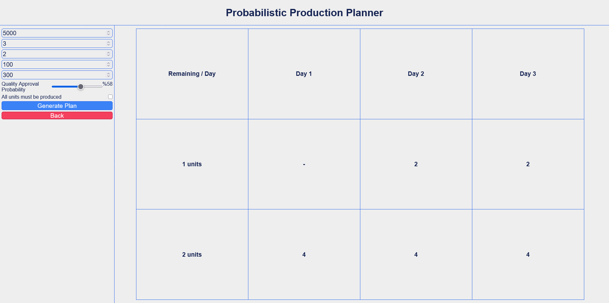

# 🎯 Probabilistic Production Planner

A dynamic programming-based web tool to determine the most cost-effective production schedule under uncertainty.

## 🧠 What It Does

This app helps you decide:
- **How many units to produce per day** given a limited number of days.
- **Cost-effective launch strategies** when quality control is probabilistic.
- Whether it's more economical to build in bulk or spread production across multiple days.

It considers:
- ✅ Order value
- ⏳ Available production days
- 📦 Order size
- 💸 Unit production cost
- 🚀 Cost per production launch
- 📊 Probability of passing quality control
- 🔒 Option to enforce "all-or-nothing" production

---

## 🚀 Technologies Used

- HTML5 + CSS3
- Vanilla JavaScript (no libraries!)
- Dynamic Programming
- Binomial Distribution (Probabilistic Modeling)

---

## 📷 Demo

 <!-- Optional: Replace with a real screenshot or remove this section -->

---

## 📦 How to Run

1. Clone this repo:
```bash
git clone https://github.com/your-username/probabilistic-production-planner.git
```
2. Open ```index.html``` in your browser.

## 🔗 Connect with Me
[](mailto:mohamad.m.khoda03@gmail.com)
[](https://www.linkedin.com/in/mohammad-mahdi-khodadadi)
[](https://instagram.com/mahdi.khodadadi03)

